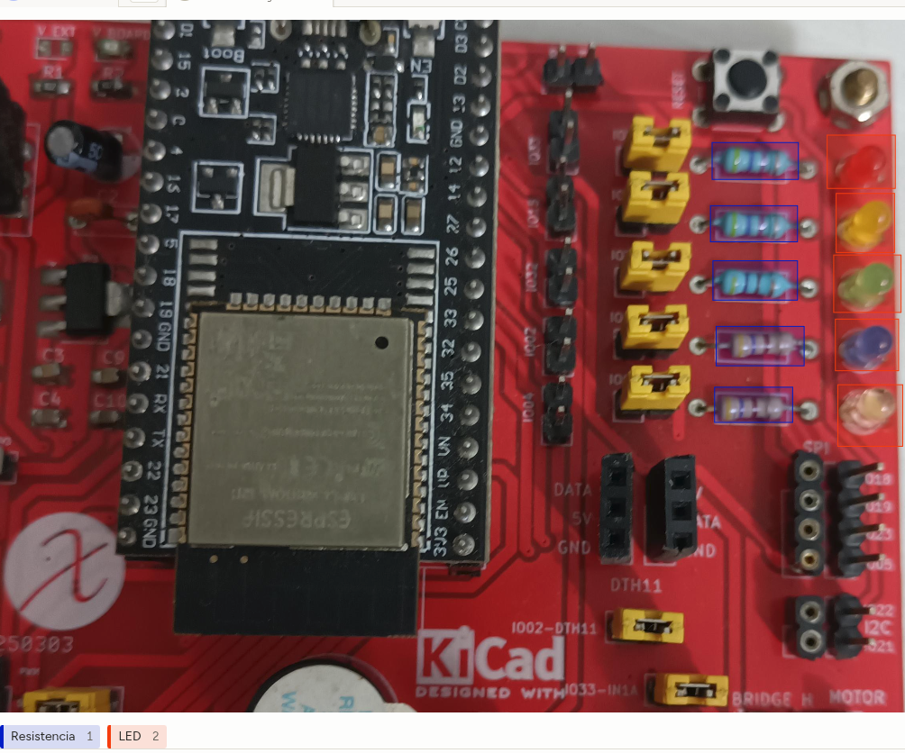
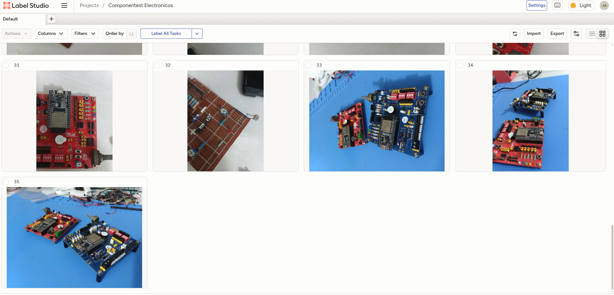

# Deteccion de componentes electronicos 

Solo se etiquetan 2 componenentes electronicos, exportado en formato YOLO con imgagenes.

## Clases

- Resistencia
- LED

[Ver el archivo de clases](componentes_electronicos/classes.txt)

---

